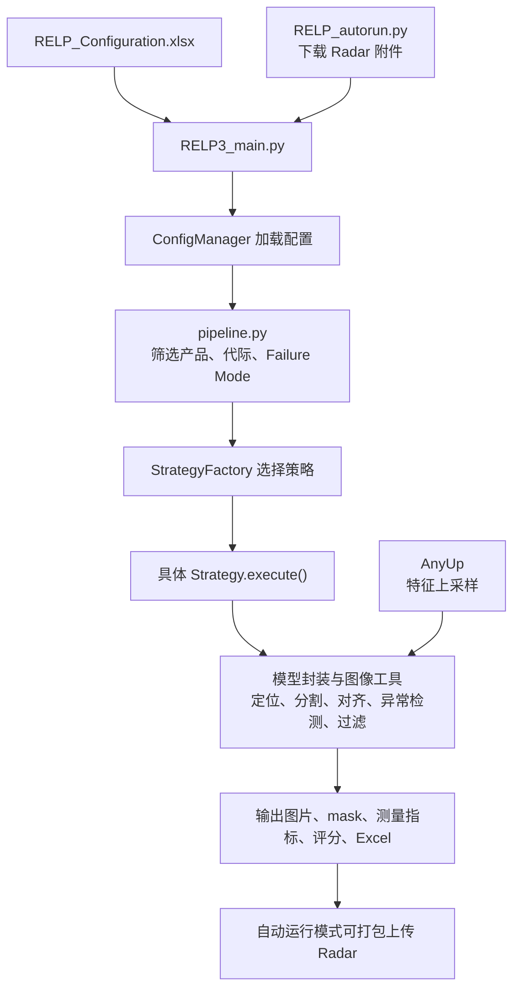

这个仓库的核心是一套 **由 Excel 配置驱动的产品图像缺陷检测与量化系统**。它把 Detectron2、SAM2、DINOv3、Grounding DINO，以及传统图像过滤、颜色聚类和评分方法组合起来，针对不同产品和 Failure Mode 选择不同处理流程。

我已只读检查目录、Python 脚本和配置工作簿，并核对主要调用关系。仓库共有 **71 个 Python 文件、约 3.06 万行代码**，其中 RELP 主项目 46 个，AnyUp 子项目 25 个。全部 Python 文件通过了静态语法解析；本次没有运行模型推理，也没有修改仓库文件。

下面提到的 **FM** 是 Failure Mode，即缺陷／失效模式；**DUT** 是被检测的产品主体；**mask** 是标记产品或缺陷区域的像素掩膜。

从目录上看，代码可以分成下面几层：

```text
C:\Users\anxin\ssd_work\RELP\
├─ RELP3_main.py                 主分析入口
├─ RELP_autorun.py               Radar 下载、分析、上传的自动运行入口
├─ RELP_Configuration.xlsx       产品、算法、权重、输出等业务配置
│
├─ utils\
│  ├─ config\
│  │  └─ config_manager.py       Excel 配置加载、缓存和类型化
│  ├─ core\
│  │  ├─ pipeline.py            主流程及策略分发
│  │  ├─ schema.py              上下文、节点参数、节点输出的数据模型
│  │  └─ strategies\            各种具体检测策略
│  ├─ wrappers\                 Detectron2、SAM2、Grounding DINO 封装
│  ├─ *_ops.py                  图像、裁剪、过滤、输出等工具
│  ├─ dinov3_utils.py           DINO 异常检测及 AnyUp 接入
│  ├─ knn_utils.py              颜色聚类、孔洞及稀疏异常检测
│  ├─ scoring_*.py              缺陷评分和评分权重拟合
│  ├─ utils_general.py          公共接口、全局参数及旧代码兼容层
│  └─ RELP3_main.py             与根目录入口相同的重复副本
│
└─ anyup-main\                  独立的 AnyUp 特征上采样子项目
   ├─ train.py                  AnyUp 训练入口
   ├─ hubconf.py                torch.hub 模型加载入口
   ├─ example_usage.ipynb       推理演示
   ├─ config\                  Hydra 训练配置
   └─ anyup\                   模型、注意力层、损失和数据工具
```

实际运行关系如下。不同策略会省略或组合其中某些处理环节：



入口、配置和调度部分，是理解整个项目最值得先读的代码：

| 文件 | 主要作用 |
|---|---|
| [RELP3_main.py](C:/Users/anxin/ssd_work/RELP/RELP3_main.py:24) | 正式的主分析入口。设置模块搜索路径，加载根目录的 Excel，然后创建 `DefectDetectionPipeline` 并运行。它本身基本不包含图像算法。 |
| [RELP_autorun.py](C:/Users/anxin/ssd_work/RELP/RELP_autorun.py:888) | 自动化入口。读取 `Auto Run` 表，每条任务启动一个监控线程，完成认证、附件下载、解压、按 FM 分组、启动主分析进程、结果打包上传。 |
| [config_manager.py](C:/Users/anxin/ssd_work/RELP/utils/config/config_manager.py:60) | 单例配置管理器。缓存 Excel 各 sheet，并将部分配置解析为 `FailureModeConfig`、`FlowConfig` 等对象，供策略读取。当前仍同时保留原始 DataFrame 和类型化配置两种访问方式。 |
| [pipeline.py](C:/Users/anxin/ssd_work/RELP/utils/core/pipeline.py:157) | 解析命令行参数，读取配置，筛选 FM／产品／代际，再交给策略工厂。类中的 `_resolve_model_weights()` 还为多个策略提供模型路径解析。 |
| [schema.py](C:/Users/anxin/ssd_work/RELP/utils/core/schema.py:4) | 定义 Pydantic 数据模型，包括上下文、SAM／Filtering／Scoring 等节点参数，以及 `NodePayload`、`NodeMetadata`。**目前这些类型没有接入主流水线或策略执行。** |
| [utils/RELP3_main.py](C:/Users/anxin/ssd_work/RELP/utils/RELP3_main.py:1) | 与根目录版本内容完全相同。由于它按自身所在目录定位配置文件，作为独立入口使用时会指向不同位置；阅读和运行应以根目录版本为准。 |

自动运行脚本中，有三个细节值得单独说明：

- `radar_download()` 按附件类型和上传时间筛选文件，并通过下载历史记录避免重复下载。
- 下载可以由多个线程进行，但分析阶段使用 `analysis_lock`，同一进程中会串行触发主分析。
- **`Frequency(hr)` 实际表示附件回溯多少小时；轮询间隔固定为一小时。** 对应实现见 [monitor_radar_task()](C:/Users/anxin/ssd_work/RELP/RELP_autorun.py:599) 和 [循环末尾的等待逻辑](C:/Users/anxin/ssd_work/RELP/RELP_autorun.py:881)。

[RELP_Configuration.xlsx](C:/Users/anxin/ssd_work/RELP/RELP_Configuration.xlsx) 实际承担了大量业务逻辑。理解这些 sheet，比单独看函数名更容易理解程序为什么走某条分支：

| Sheet | 决定的内容 |
|---|---|
| `Failure Mode` | 执行哪些产品、代际、FM，以及输入图片路径、输出路径、SAM 模式等。 |
| `Flow` | 每种 FM 的识别方法、后处理、裁剪尺寸、对齐、上采样和调试配置。 |
| `Weights` | DUT 检测、缺陷检测、DINO、SAM 等模型的配置和权重路径。 |
| `General FM` | 按文件名／路径映射图片，指定目标 FM、配置组、缺陷类别和作用区域。 |
| `Filtering` | RGB／HSV、颜色距离、形态学、区域及面积过滤规则。 |
| `Adaptive Gaussian` | 自适应阈值、对比度、去噪、反色等参数。 |
| `KNN` | 颜色样本、目标 RGB、聚类设置、孔洞检测和最小缺陷面积。 |
| `Dino_TH` | DINO 异常图阈值及相关 flooding 设置。 |
| `Scaling` | DUT mask 和需移除特征的缩放参数。 |
| `Fine_Tuning` | 分割细化及接受阈值等配置。 |
| `Reference` | 参照物尺寸、面积以及像素与物理尺寸换算信息。 |
| `Output` | 输出格式、mask 颜色、测量指标、颜色分箱和评分设置。 |
| `Auto Run` | Radar 来源、附件类型、下载目录、FM 映射及上传内容。 |

工作簿还有几个带 `(2)` 后缀的 sheet；当前主配置加载代码读取的是原名 sheet，**不会因为副本里存在更多任务就自动执行它们**。

当前原名 `Failure Mode` 表中只有一个任务：**`Power_Adapter / 2025 / Crop`**。其输入为 `Pics/power`，`Crop_Output_Dim=1280`。对应流程是：

1. 用 DUT Detectron 模型找出图片中的产品框。
2. 用 SAM2 为每个产品生成 mask。
3. 将背景置黑，并按单个实例裁剪。
4. 等比例缩放，放入 1280 × 1280 的黑色画布。

按现有代码，预期输出位置是：

```text
C:\Users\anxin\ssd_work\RELP\Result\Power_Adapter_2025_Crop_Result\Crop_Result
```

这个配置下的主要任务是**产品裁剪和画布准备**，不会自动执行工作簿里列出的所有缺陷检测算法。

具体业务由 `utils/core/strategies` 中的脚本承担。每个策略通常负责自己的配置解析、模型加载、图片遍历和结果输出：

| 脚本 | 主要作用 |
|---|---|
| [base_strategy.py](C:/Users/anxin/ssd_work/RELP/utils/core/strategies/base_strategy.py:5) | 定义公共基类 `AnalysisStrategy`。保存任务上下文，恢复评分和输出配置，并提供读取图片、DUT 分割与对齐的公共前处理。 |
| [strategy_factory.py](C:/Users/anxin/ssd_work/RELP/utils/core/strategies/strategy_factory.py:10) | 根据 FM 名称和 `Defect Identification` 字符串选择策略，是业务路由的集中入口。 |
| [general_fm_dispatcher.py](C:/Users/anxin/ssd_work/RELP/utils/core/strategies/general_fm_dispatcher.py:10) | 多 FM 调度器。按文件名映射分组，可先执行一阶段获取 mask／中间数据，再把不同图片组交给目标 FM 的策略。 |
| [crop_strategy.py](C:/Users/anxin/ssd_work/RELP/utils/core/strategies/crop_strategy.py:10) | 多实例裁剪。支持普通 Crop、Dino Crop 和 GroundingCrop；核心是找框、SAM 分割、去背景、裁剪及尺寸归一化。 |
| [canvas_prepare_strategy.py](C:/Users/anxin/ssd_work/RELP/utils/core/strategies/canvas_prepare_strategy.py:9) | K11p／Canvas Prepare 专用流程：先把产品整理到规整画布，再在画布上检测缺陷、执行过滤和参数输出。包含专用模型路径与类别配置。 |
| [dino_strategy.py](C:/Users/anxin/ssd_work/RELP/utils/core/strategies/dino_strategy.py:12) | DINO 异常检测主策略。串联 DUT 对齐、DINOv3 推断、可选 AnyUp、区域限制、Filtering、测量和 Excel 输出。 |
| [knn_strategy.py](C:/Users/anxin/ssd_work/RELP/utils/core/strategies/knn_strategy.py:18) | 颜色聚类与异常区域分析策略，面向纺织品变色等任务。按图片颜色匹配配置，执行聚类、孔洞／异常检测和可选过滤。 |
| [filtering_strategy.py](C:/Users/anxin/ssd_work/RELP/utils/core/strategies/filtering_strategy.py:11) | 传统图像处理策略。解析 `Filtering[...]` 等方法，串联阈值、颜色、形态学及区域操作，并输出测量结果。 |
| [detectron_seg_strategy.py](C:/Users/anxin/ssd_work/RELP/utils/core/strategies/detectron_seg_strategy.py:40) | Detectron 实例分割流程，重点包含硅胶脱层场景。将缺陷 mask 与 DUT mask 求交，再用 SAM2 细化，处理多产品、SN 对应和缺陷尺寸。 |
| [object_detection_strategy.py](C:/Users/anxin/ssd_work/RELP/utils/core/strategies/object_detection_strategy.py:13) | 基于 Detectron 的目标检测。可先检测并分割产品，再在产品局部图中运行第二层缺陷检测。 |
| [grounding_dino_strategy.py](C:/Users/anxin/ssd_work/RELP/utils/core/strategies/grounding_dino_strategy.py:12) | 按自然语言 prompt 找目标框，支持长宽比、置信度和 Top-K 筛选，输出框图及可选后处理图片。它本身不做 SAM 精细分割。 |
| [grounding_sam_strategy.py](C:/Users/anxin/ssd_work/RELP/utils/core/strategies/grounding_sam_strategy.py:15) | Grounding DINO 找框，SAM2 生成像素区域，再接可选 DINO 异常检测、Filtering 和参数化输出。 |
| [complex_bleach_strategy.py](C:/Users/anxin/ssd_work/RELP/utils/core/strategies/complex_bleach_strategy.py:15) | `hiaa bleach` 专用复合流程。组合文本定位、SAM、可选 DINO，以及 matte／halo 等场景的 HSV 和过滤分支。 |
| [complex_textile_strategy.py](C:/Users/anxin/ssd_work/RELP/utils/core/strategies/complex_textile_strategy.py:17) | 纺织品／bubble 专用复合流程。按主体长宽比分面，处理孔洞、按钮附近区域、切片和 red tag 参照，再做 DINO 检测与评分。 |
| [macbook_light_bleed_strategy.py](C:/Users/anxin/ssd_work/RELP/utils/core/strategies/macbook_light_bleed_strategy.py:16) | MacBook 漏光专项流程。识别屏幕及圆形参照物，用 SAM 得到区域，在屏幕内过滤漏光并计算面积占比。 |
| [dynamic_routing_strategy.py](C:/Users/anxin/ssd_work/RELP/utils/core/strategies/dynamic_routing_strategy.py:18) | 尝试将复杂流程的提示词、长宽比分支、切片、权重和评分参数放到 JSON 中配置；实际执行仍是手写的 Grounding DINO → SAM → DINO 流程。 |

这里的路由有**优先顺序**：先检查 `General FM`，再匹配专用 FM，最后按方法字符串匹配通用策略。例如包含 `KNN` 的方法会先于普通 `Dino` 匹配，所以 `Dino+KNN[...]` 首先进入 `KnnStrategy`。它不是把字符串中的算法自动拆成任意组合的通用执行引擎。

策略下面的工具层，承担可复用的算法和文件处理。这个目录中名称带 `utils` 的文件也有大量业务逻辑，并非都只是小工具：

| 脚本 | 主要作用 |
|---|---|
| [utils_general.py](C:/Users/anxin/ssd_work/RELP/utils/utils_general.py:1) | 公共接口与旧代码兼容层。转接多个模块，保存共享参数，还保留通用检测、SAM 分割、缺陷量化、文件名解析等实现。是目前耦合较多的中心文件。 |
| [base_utils.py](C:/Users/anxin/ssd_work/RELP/utils/base_utils.py:2) | 提供 `_norm()`，统一字符串大小写和分隔符，便于匹配产品、FM 和配置键。 |
| [io_ops.py](C:/Users/anxin/ssd_work/RELP/utils/io_ops.py:9) | Radar 上传下载、压缩解压、目录创建、文件移动，以及从路径提取配置组和产品面信息。 |
| [auth.py](C:/Users/anxin/ssd_work/RELP/utils/auth.py:8) | 获取和缓存 AppleConnect／Insight token，依赖外部认证 CLI。 |
| [bbox_ops.py](C:/Users/anxin/ssd_work/RELP/utils/bbox_ops.py:7) | 检测框几何工具：IoU、框内缺陷比例、框排序、缩放、离群框剔除、坐标及 DataFrame 转换。 |
| [crop_ops.py](C:/Users/anxin/ssd_work/RELP/utils/crop_ops.py:2) | 产品裁剪与对齐：旋转校正、方向判断、背景／特征移除、缩放 padding、大物体分块裁剪。 |
| [cv_ops.py](C:/Users/anxin/ssd_work/RELP/utils/cv_ops.py:7) | 通用视觉操作：图片读取、轮廓和 mask 操作、旋转、RGB／HSV 过滤、叠加图与中间结果保存。 |
| [detectron_ops.py](C:/Users/anxin/ssd_work/RELP/utils/detectron_ops.py:23) | Detectron 模型加载、预测结果解析、检测框与 mask 提取、可视化，以及裂纹／缺陷宽度和长度等分析。 |
| [dinov3_utils.py](C:/Users/anxin/ssd_work/RELP/utils/dinov3_utils.py:190) | DINOv3／ViTill 模型加载和单图异常检测核心。计算编码器与解码器特征差异，生成异常图、热力图和缺陷 mask，并接入 AnyUp 与后处理。 |
| [knn_utils.py](C:/Users/anxin/ssd_work/RELP/utils/knn_utils.py:216) | 颜色聚类、邻域连接、孔洞检测、稀疏异常检测、区域筛选及可视化。内部既有 KMeans，也有近邻处理，职责比名称更广。 |
| [filtering_ops.py](C:/Users/anxin/ssd_work/RELP/utils/filtering_ops.py:701) | 核心过滤调度模块。解析并执行面积、颜色距离、RGB／HSV、Top-Hat、阈值、ROI、背景减除、ODBP、Slicing 等操作。是仓库最大的脚本，约 4281 行。 |
| [general_fm_ops.py](C:/Users/anxin/ssd_work/RELP/utils/general_fm_ops.py:5) | General FM 的底层规则：判断图片是否匹配 Mapping，并根据检测类别、bbox 和 Scope 限制缺陷 mask。 |
| [advanced_operators.py](C:/Users/anxin/ssd_work/RELP/utils/advanced_operators.py:5) | 复杂策略使用的三个专门算子：孤立锚点筛框、空间惩罚区域、相对坐标切片。 |
| [shape_ops.py](C:/Users/anxin/ssd_work/RELP/utils/shape_ops.py:4) | 按轮廓宽高比、圆度等形状特征过滤，并提供药丸状轮廓的对称性检查。 |
| [output_ops.py](C:/Users/anxin/ssd_work/RELP/utils/output_ops.py:171) | 测量与报表核心。组织 SN 和结果字段、匹配参照物、计算面积／尺寸／轮廓／骨架指标，并生成参数化 Excel 和评分列。 |
| [scoring_utils.py](C:/Users/anxin/ssd_work/RELP/utils/scoring_utils.py:16) | 评分算法：互补分数、指数衰减权重、DINO 距离分箱、局部对比度和形态学对比度评分。 |
| [scoring_optimizer.py](C:/Users/anxin/ssd_work/RELP/utils/scoring_optimizer.py:17) | 将人工 Grade／Subgrade 与算法参数表对齐，用 Ridge 回归拟合权重，评估相关性和异常样本；更适合离线调分使用。 |

模型封装集中在三个脚本中：

| 脚本 | 主要作用 |
|---|---|
| [detectron_wrapper.py](C:/Users/anxin/ssd_work/RELP/utils/wrappers/detectron_wrapper.py:4) | 从 pickle 配置和权重创建 Detectron2 `DefaultPredictor`，并尝试从 `classes.rtf` 注册类别名称。 |
| [sam2_wrapper.py](C:/Users/anxin/ssd_work/RELP/utils/wrappers/sam2_wrapper.py:5) | 统一 SAM2 使用接口，支持官方模型和 ONNXRuntime 编解码模型，以及点／框提示。 |
| [grounding_dino_wrapper.py](C:/Users/anxin/ssd_work/RELP/utils/wrappers/grounding_dino_wrapper.py:7) | 封装 Hugging Face Grounding DINO，输入图像和文本，返回包含类别、置信度和 bbox 的检测结果。 |

可以用一句话区分几个模型在项目中的职责：**Detectron2 和 Grounding DINO 用来找目标，SAM2 用来勾出目标边界，DINOv3／ViTill 用来生成异常程度图，AnyUp 用来提升特征图的空间分辨率。**

AnyUp 子项目同时包含推理代码和独立训练代码。主项目只需要其中的上采样能力；它的训练流程不会由 RELP 主入口自动启动：

| 脚本 | 主要作用 |
|---|---|
| [train.py](C:/Users/anxin/ssd_work/RELP/anyup-main/train.py:30) | Hydra 训练入口。加载冻结的视觉 backbone，用高低分辨率特征训练 AnyUp，记录日志并保存 checkpoint。 |
| [hubconf.py](C:/Users/anxin/ssd_work/RELP/anyup-main/hubconf.py:7) | 提供 `anyup()` 和 `anyup_multi_backbone()` 两个 torch.hub factory，可下载对应预训练权重。 |
| [example_usage.ipynb](C:/Users/anxin/ssd_work/RELP/anyup-main/example_usage.ipynb) | 演示用 notebook：提取 DINOv2 特征、用 AnyUp 上采样，再通过 PCA 可视化比较结果。 |
| [model.py](C:/Users/anxin/ssd_work/RELP/anyup-main/anyup/model.py:13) | 定义 `AnyUp` 主模型。接收引导图像和低分辨率特征，通过交叉注意力生成高分辨率特征，保留输入特征的通道数。 |
| [loss.py](C:/Users/anxin/ssd_work/RELP/anyup-main/anyup/loss.py:6) | 定义训练损失 `Cosine_MSE`，组合余弦相似度损失和归一化 MSE。 |
| [vit_wrapper.py](C:/Users/anxin/ssd_work/RELP/anyup-main/anyup/backbone/vit_wrapper.py:48) | 封装 timm 的 DINO、DINOv2、CLIP、SigLIP 等 ViT，统一提取中间特征供训练使用。 |
| [convolutions.py](C:/Users/anxin/ssd_work/RELP/anyup-main/anyup/layers/convolutions.py:4) | 定义残差卷积模块 `ResBlock`，用于图像和特征编码。 |
| [feature_unification.py](C:/Users/anxin/ssd_work/RELP/anyup-main/anyup/layers/feature_unification.py:7) | 将不同通道数的输入特征转换为固定维度的注意力 key 表示。 |
| [positional_encoding.py](C:/Users/anxin/ssd_work/RELP/anyup-main/anyup/layers/positional_encoding.py:9) | 实现二维 RoPE 位置编码，让注意力保留空间位置信息。 |
| [attention_masking.py](C:/Users/anxin/ssd_work/RELP/anyup-main/anyup/layers/attention/attention_masking.py:6) | 计算局部注意力窗口及 mask，限制高分辨率位置所关注的低分辨率区域。 |
| [chunked_attention.py](C:/Users/anxin/ssd_work/RELP/anyup-main/anyup/layers/attention/chunked_attention.py:20) | 标准交叉注意力实现，支持 query 分块以降低内存占用。 |
| [natten_attention.py](C:/Users/anxin/ssd_work/RELP/anyup-main/anyup/layers/attention/natten_attention.py:9) | 可选的 NATTEN 局部注意力实现，需要额外依赖。 |
| [training.py](C:/Users/anxin/ssd_work/RELP/anyup-main/anyup/utils/training.py:16) | 训练辅助：随机种子、TensorBoard、图像增强、DataLoader、batch 整理和设备迁移。 |
| [image_dataset.py](C:/Users/anxin/ssd_work/RELP/anyup-main/anyup/utils/dataloader/image_dataset.py:7) | ImageFolder 风格的数据集，支持文件列表缓存、尺寸索引和过小图片过滤。 |
| [post_collate.py](C:/Users/anxin/ssd_work/RELP/anyup-main/anyup/utils/dataloader/post_collate.py:16) | batch 级随机裁剪，生成彼此对应的高分辨率图、引导图、增强图和低分辨率图。 |
| [compute_sizes_index.py](C:/Users/anxin/ssd_work/RELP/anyup-main/anyup/utils/dataloader/compute_sizes_index.py:57) | 扫描训练图片尺寸，生成文件列表及尺寸索引缓存。 |
| [img.py](C:/Users/anxin/ssd_work/RELP/anyup-main/anyup/utils/img.py:3) | 生成二维坐标网格，供位置编码使用。 |
| [gaussian_derivative_initialization.py](C:/Users/anxin/ssd_work/RELP/anyup-main/anyup/utils/gaussian_derivative_initialization.py:15) | 生成高斯导数滤波核及相关基函数，用于特征统一模块的初始化。 |
| [attention_visualization.py](C:/Users/anxin/ssd_work/RELP/anyup-main/anyup/utils/visualization/attention_visualization.py:36) | 将注意力映射成颜色图，便于观察高分辨率位置关注了哪些低分辨率位置。 |

AnyUp 的 [config 目录](C:/Users/anxin/ssd_work/RELP/anyup-main/config) 分别配置模型、backbone、数据集、DataLoader 和 AdamW；[pyproject.toml](C:/Users/anxin/ssd_work/RELP/anyup-main/pyproject.toml) 定义的是 **AnyUp 子项目**的依赖，不能当作整个 RELP 的完整环境清单。

各层的 `__init__.py` 大多为空文件或用于重新导出类。一个有实际逻辑的例外是 [attention/__init__.py](C:/Users/anxin/ssd_work/RELP/anyup-main/anyup/layers/attention/__init__.py:12)：它负责选择标准注意力或 NATTEN，在后者不可用时回退。

RELP 接入 AnyUp 的方式也与 notebook 不同：主项目在 [load_anyup_upsampler()](C:/Users/anxin/ssd_work/RELP/utils/dinov3_utils.py:41) 中直接创建 `AnyUp()` 并加载本地权重；随后分别上采样 DINO 编码器与解码器的特征，再计算余弦差异异常图。它没有通过 notebook 中的 `torch.hub.load()` 自动完成这一步。

检查过程中，以下几处会直接影响对仓库状态的判断：

- **当前目录缺少运行资源。** 没有配置使用的 `Pics`、`weights` 目录，也没有代码引用的本地 `Dinomaly` 等目录。根目录未发现 RELP 自身的 README、依赖清单或测试目录，因此目前不能仅靠这个工作区确认端到端可运行。
- **AnyUp 的搜索路径与实际目录不一致。** [dinov3_utils.py:31](C:/Users/anxin/ssd_work/RELP/utils/dinov3_utils.py:31) 添加的是 `Dinomaly/anyup-main`，实际源码在根目录 `anyup-main`。除非环境另外安装了可用包，否则这条本地接入路径需要调整。
- **当前 Crop 策略没有完整遵循入口配置。** [crop_strategy.py:30](C:/Users/anxin/ssd_work/RELP/utils/core/strategies/crop_strategy.py:30) 会重新读取 Excel 的 `Pic_Path`，覆盖入口传入的 `--pic_path`；它也没有根据 `SAM Mode=Onnx` 字段选择模型，而是按自身权重解析和回退逻辑初始化 SAM。
- **配置键还不完全统一。** `ConfigManager` 的类型化 Flow 缓存只以 FM 为键，同 FM 多行会覆盖；主 Pipeline 取方法时又取第一条 Flow。产品、代际和 `Config_Group` 的组合配置需要结合各策略实际取值方式判断。
- **DAG 相关代码尚未形成完整执行链。** [schema.py](C:/Users/anxin/ssd_work/RELP/utils/core/schema.py:4) 尚无外部引用；[Textile_R692_bubble.json](C:/Users/anxin/ssd_work/RELP/utils/core/strategies/configs/Textile_R692_bubble.json:1) 使用 `pipeline` 节点列表，但动态策略读取的是另一组配置字段，没有解释执行这些节点。
- **部分非当前策略存在明确的运行时问题。** 例如 [FilteringStrategy](C:/Users/anxin/ssd_work/RELP/utils/core/strategies/filtering_strategy.py:277) 使用未定义的 `cfg_mgr`，Canvas 策略使用 `pd` 却没有导入 pandas。这也说明静态语法检查通过，并不等于每条业务分支都能运行。

如果接下来要深入阅读或维护，我建议先沿着当前任务读 **主入口 → ConfigManager → Pipeline → StrategyFactory → CropStrategy**。理解这条链后，再读 `DinoStrategy`，以及它依赖的 `dinov3_utils.py`、`filtering_ops.py` 和 `output_ops.py`；这几处覆盖了项目最主要的检测、后处理与结果量化逻辑。
